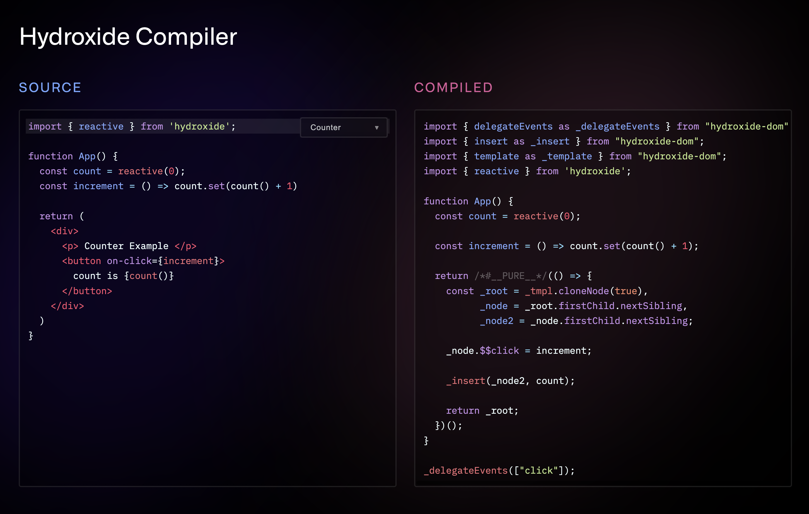

# babel-plugin-hydroxide

Compiler for [Hydroxide Framework](https://github.com/hydroxide-js/hydroxide)

It compiles JSX into efficient Template Hydrations

 

## Playground

Checkout the Playground to see how it works:

https://hydroxide-compiler-playground.pages.dev/

