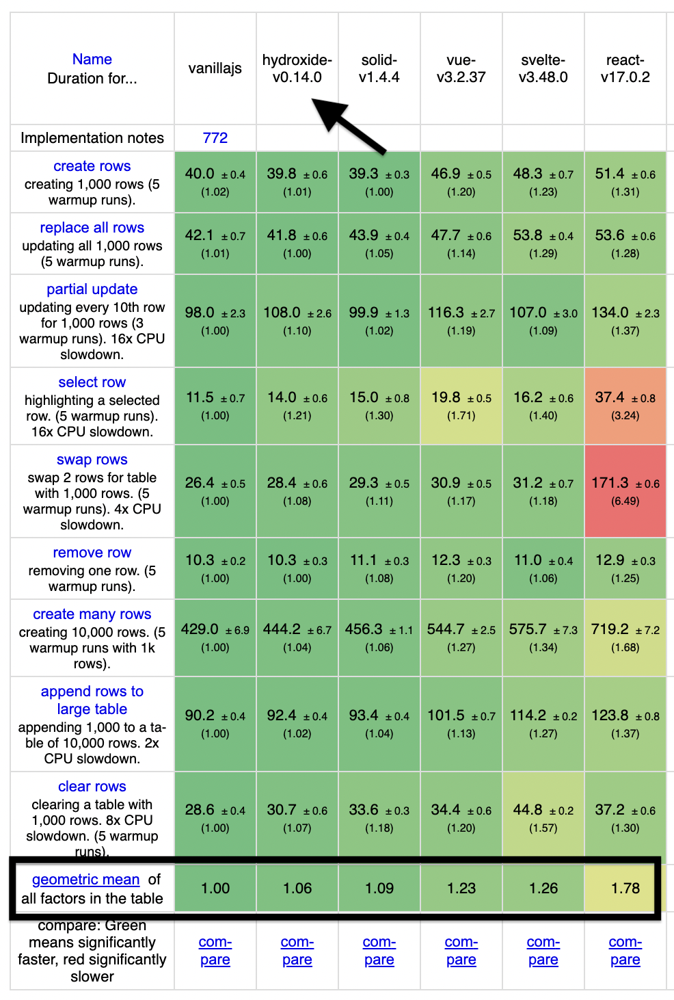

# Hydroxide

Next Generation High Performance Reactive JavaScript Framework.

Hydroxide is a **Reactive framework** that is designed to be Extremely Fast and Easy to Use.

It does not use a Virtual DOM and instead creates a dependency graph and surgically updates the DOM when state is updated. This means that your **component only needs to run once**.

Hydroxide's **Compiler** converts the JSX into Highly Optimized DOM manipulation code. Checkout the [Hydroxide Compiler Playground](https://hydroxide-playground.vercel.app/)

Hydroxide provides a first class support for **ergonomic complex state Management** out of the box.

 

## Examples

Checkout below Sandbox Examples to get a taste of Hydroxide's API

- [Simple Counter](https://codesandbox.io/s/counter-vridyt?file=/src/Counter.jsx)
- [Todo App](https://codesandbox.io/s/todoapp-qs5uj6?file=/src/index.jsx)
- [Input Binding](https://codesandbox.io/s/input-binding-z1g2g3?file=/src/index.jsx)
- [Conditional Rendering](https://codesandbox.io/s/conditional-rendering-zg0cdg?file=/src/index.jsx)
- [Lifecycle Hooks](https://codesandbox.io/s/lifecycle-hooks-33mop9?file=/src/index.jsx)
- [Components and Props](https://codesandbox.io/s/nested-components-nr72sm?file=/src/index.jsx)
- [Memo](https://codesandbox.io/s/memo-iz8cgc?file=/src/index.jsx)
- [Effect](https://codesandbox.io/s/effect-z3buo6?file=/src/Counter.jsx)

 

## Monorepo Details

### [babel-plugin-hydroxide](https://github.com/hydroxide-js/hydroxide/tree/main/packages/web/jsx-compiler)

Compiler for the Hydroxide Framework. It compiles JSX to Efficient Template Hydrations

### [hydroxide](https://github.com/hydroxide-js/hydroxide/tree/main/packages/core)

Reactive Core of the Hydroxide framework. Contains APIs for state management, effects and lifecycle hooks

### [hydroxide-dom](https://github.com/hydroxide-js/hydroxide/tree/main/packages/web/renderer)

DOM renderer for the Hydroxide Framework

### [hydroxide-jsx](https://github.com/hydroxide-js/hydroxide/tree/main/packages/web/jsx-types)

JSX Type definitions for HTML elements

 

## Performance Benchmark

Hydroxide is The Fastest Framework in [JS-Framework-Benchmark](https://github.com/krausest/js-framework-benchmark) - Much Faster than Vue, Svelte and React and comparable performance to Solid.

Hydroxide will officially be added in JS-framework-benchmark repo after V1.0 release

 
