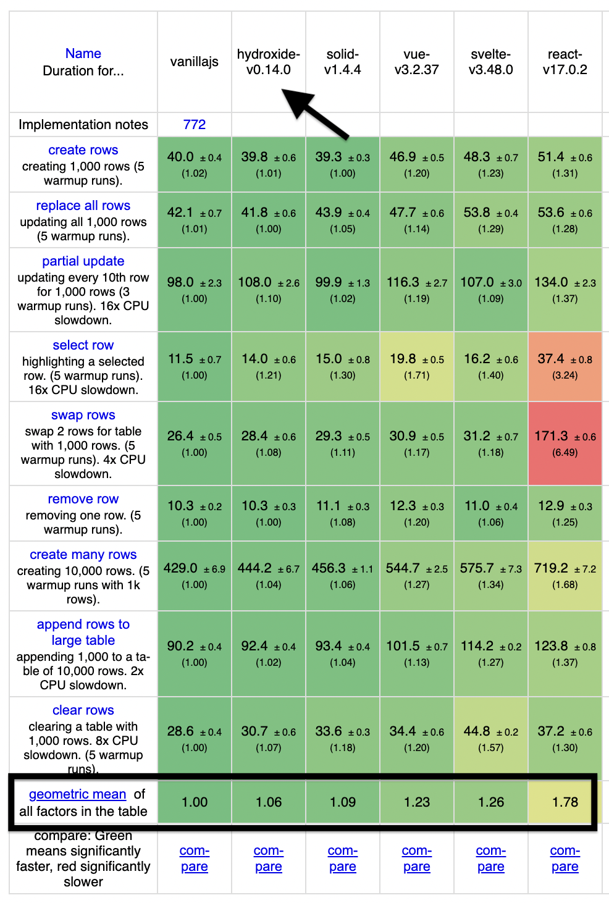

# Hydroxide

High-performance reactive JavaScript framework. No Virtual DOM. No re-renders. No dependency arrays.

  <a href="https://hydroxide-js.dev/">Website</a> ·
  <a href="https://hydroxide-js.dev/playground">Playground</a>

## Features

- **High Performance** — No virtual DOM diffing, NO re-renders.. Surgical updates directly to the exact nodes that change.

- **Optimized with Compiler** — JSX compiles to optimized DOM operations. [View compiler output on Playground](https://hydroxide-compiler-playground.pages.dev/)

- **Fine-Grained Reactivity** — Components don't re-render. When state changes, only the specific DOM nodes that depend on it update.

- **Automatic Dependency Tracking** — No manual dependency arrays. The runtime automatically detects dependencies

- **Ergonomic State Management** — First-class support for nested objects, arrays, and deep updates

## Performance Benchmark

Hydroxide delivers exceptional runtime performance, benchmarked on [JS Framework Benchmark](https://github.com/krausest/js-framework-benchmark) — the industry standard for measuring framework performance.

Geometric mean across all operations. Lower is faster. 1.0 is vanilla JavaScript baseline.

## Packages

| Package                                                 | Description                                                    |
| ------------------------------------------------------- | -------------------------------------------------------------- |
| [`hydroxide`](./packages/core)                          | Reactive core — state management, effects, and lifecycle hooks |
| [`hydroxide-dom`](./packages/web/renderer)              | DOM renderer                                                   |
| [`hydroxide-jsx`](./packages/web/jsx-types)             | JSX type definitions for HTML elements                         |
| [`babel-plugin-hydroxide`](./packages/web/jsx-compiler) | Compiler — transforms JSX to optimized DOM operations          |
| [`vite-plugin-hydroxide`](./packages/vite-plugin)       | Vite integration for Hydroxide                                 |

## License

MIT

## Author

[Manan Tank](https://manantank.dev/)
